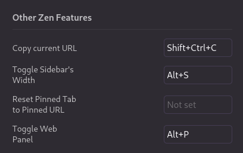
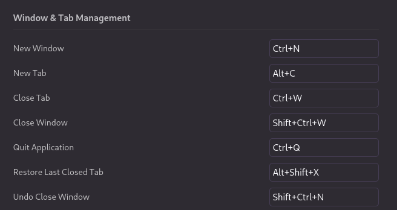
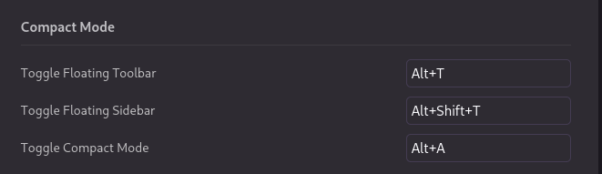
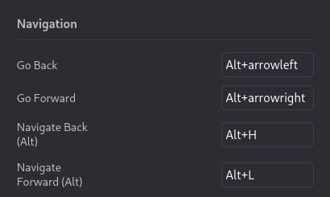

# zen-conf

my custom css and js hacks on the zen-browser

## installation

- Use the instructions to install [fx-autoconfig](https://github.com/MrOtherGuy/fx-autoconfig)
- paste the contents of the chrome folder into the `~/.zen/<profile-name>/chrome/` folder
- rebuild the startup cache by going to [about:support](about:support) and clicking the `clear startup cache` button

## keybindings

- you can apply all the keybinds by copying `zen-keboard-shortcuts.json` to your profile
- here are the changes that I suggest if you want to apply them yourself

